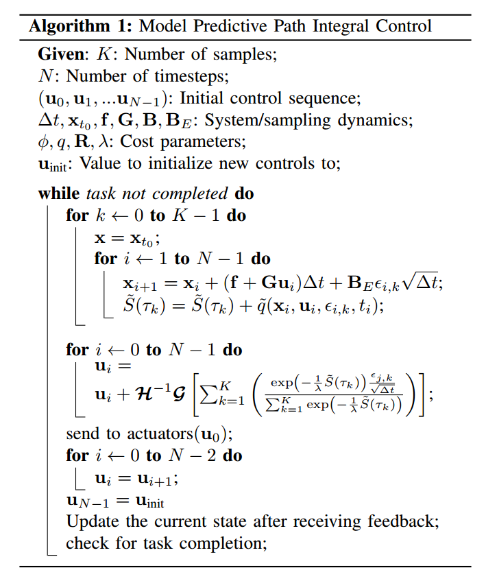
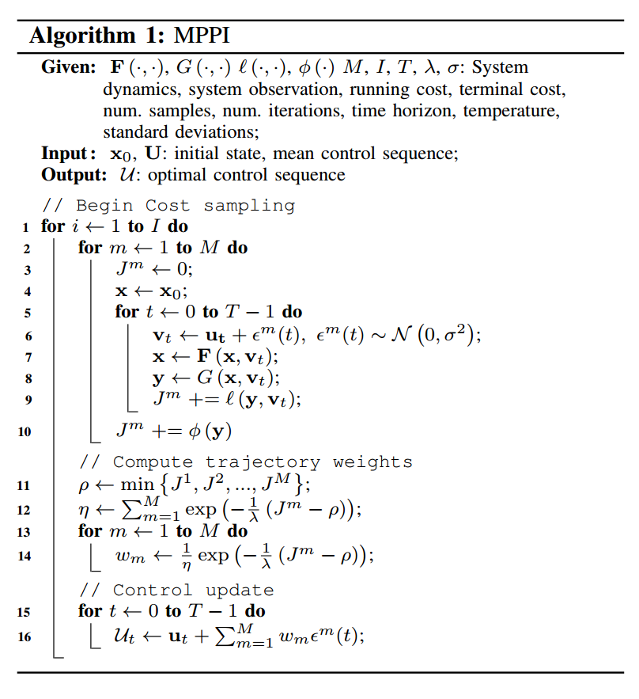
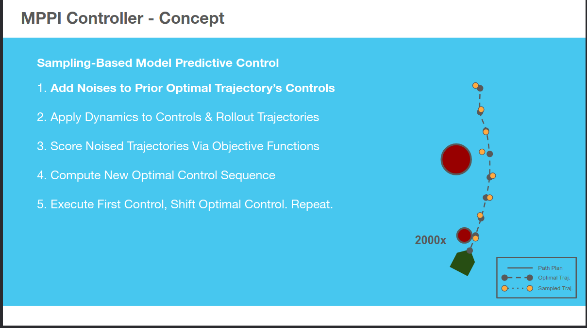

# NOTES

This markdown keeps all my notes for the RoSE 25 paper which is the final project for EE 7500 MPC class.


## Basics of Gazebo

* To list all published topic ```gz topic -l```
* To echo a gz topic: ```gz topic -e --topic  /model/a200_0000/robot/cmd_vel```


## Basics of MPPI

# Project TODO

* [ ] Understand how to put the skid-steering kinematics model for a 4 wheel robot. Go through the master thesis and book given by Farid

* [ ] Start a separate repo for a ROS 2 wrapper for MPPI-Generic. Figure out if we can create a node to run the cartpole example correctly.

---

## Done

* [x] Test and update clearpath's extra testing env to be compatible with Gazebo Harmonic (Gazebo 8). Start creating ```project.repos```
* [x] Find a suitable ackermann drive mars rover model: (ros2_rover)
* [x] Find a ROS 2 compliant skid-steering model for Clearpath Husky.
* [x] Do a one run review of the MPPI-Generic algorithm to determine how to create a wrapper for it.
* [x] Start a repo for running the project, track it directly within the workspace

## Paper note

* The test problem is formulated as finite-horizon optimal control problem [1]
* Mention uses cases such as Tube-based MPPI, Robust MPPI, Covariance Control MPPI, MPOPI, Mode-based Reinforcement Learning
* We compare the vanilla MPPI controller in MPPI-Generic vs vanilla MPPI controller in Nav2
* Use the MPPI-Generic paper to write out the initial dynamics equation.

## Which vehicle model do we use?

Two are available. Either Ackermann model (from ros2_rover) or differential drive (skid-steering) controller. We will use Skid-Steering kinematics as Husky robot will be easy to setup for experimentaionts. It appears just getting MPPI-Generic to correctly work will be enough. So we will just stick to **Skid-steering vehicle**.

Excerpt from discussion with Chatgpt o1-preview are as follows

* An Ackermann vehicle model has two control inputs: steering angle $\theta$ and linear velocity $v$.
* MPPI can utilize the Ackermann vehicle model by using it as the system dynamics within the MPPI algorithm. The Ackermann model provides the kinematic equations relating steering angle and velocity to the vehicle's motion. MPPI samples control inputs (steering and velocity), predicts future states using the Ackermann model, and evaluates costs to optimize 
the control inputs for trajectory planning.

---

### Notes on the skid-steering control model

[Modelling and Control of a Skid-Steering Mobile Robot for Indoor Trajectory Tracking Application](https://webthesis.biblio.polito.it/14638/1/tesi.pdf): This paper validated the dynamics model on the clearpath husky which is what we will use. This will be another way we will verify that the chosen model is valid.
[video1](https://www.youtube.com/watch?v=FjrgZMmWTNI): Evaluation of Skid-Steering Kinematic Model for Subartic enviornment
[Modelling, Simulation and Control of a 4-wheeled mobile robot](https://www.youtube.com/watch?v=ad2jd8SCK-o)


## Notes from Aggressive Driving with Model Predictive Path Integral Control [1]

* Algorithm 1 



* Cost formulation (Look into page )
$2.5(V_{des} - V)^2 + 50.0h(p_{x}, p_{y})^2 + 40.0C + 10.0 ||\mathbf{u}||^2$

---

## MPPI-Generic

[code](https://github.com/ACDSLab/MPPI-Generic), [paper](), [video](), [website](https://acdslab.github.io/mppi-generic-website/)

* CUDA/C++ accelerated general purpose implementation containing multiple dynamics and cost functions
* Custom cost function and dynamics can be used
* Algorithm 1 shows a much more cleaner steps of a general purpose MPPI



* The library has 6 core classes
  * Dynamics
  * Cost functions
  * Controllers
  * Sampling Distributions
  * Feedback Controllers
  * Plants
* By default **Feedback controllers** are disabled

* **Plants**: Is a wrapper around the controller. It handles communication between the controller and the system, like receiving data (e.g., system state) and sending control commands. For platforms like ROS, the Plant sets up subscribers (to get data like robot state) and publishers (to send control outputs) while also converting ROS messages into a format the controller (like MPPI) can use.

* Considerations for the **Plant** function: 
"The Plant houses methods to obtain new data such as state, calculate the optimal control sequence at a given rate using the latest information available, and provide the latest control to the external system while
providing the necessary tooling to ensure there are no race conditions."

* So we need a node class that will implement a MPPI-Generic-Plant object.
* For this project we don't need to understand how to separate computation of **Dynamics** and **Cost function** blocks.

* Three levels of API structure
  * Beginners: use a provided Dynamics, Cost Function and Controller to control a system. A minimal working example is the ```cartpole_example.cu```
  * **Intermediate**: Talks about custom dynamics and cost function. Depending on the use-case, some of the methods will be implemented twice, one for CPU and one for GPU. 

---

## Nav2 MPPI implementation notes

According to Chatgpt o1 preview, the cost function of Nav2's MPPI controller is as follows

* Slide showing the steps of sampling-based MPPI controller:



* Path tracking error: $C_{\text{path}} = w_{\text{path}} \sum_{t=1}^{N} \left( \text{distance}\left( x_t, \text{path}_t \right) \right)^2$
* Obstacle Cost: $C_{\text{obstacle}} = w_{\text{obstacle}} \sum_{t=1}^{N} \text{costmap}\left( x_t \right)$

## Notes on simulation enviornment

* We will use Clearpath husky models in Gazebo Harmonic (updated from Fortress): https://docs.clearpathrobotics.com/docs/ros/tutorials/simulator/overview/

* Clearpath has packages to use with Gazebo Fortress here: https://github.com/clearpathrobotics/clearpath_simulator
* My fork of this simulator that works with Harmonic:   

---
## Paper references

* [1] Aggressive Driving with Model Predictive Path Integral Control by Grady Williams
* [2] MPOPI paper
* [3] MPPI-Generic paper
* [4] A Multi-step Dynamics Modeling Framework For Autonomous Driving In Multiple Environments: Required to talk as an example of why I chose MPPI-Generic to package as ROS 2 package
* [5] https://ieeexplore.ieee.org/document/10665978 an example of uav simulators and potential future work

## External references

* MPPI by Autorally: https://github.com/AutoRally/autorally/wiki/Model-Predictive-Path-Integral-Controller-(MPPI)

* Easy intro section writeup: https://sites.gatech.edu/acds/mppi/