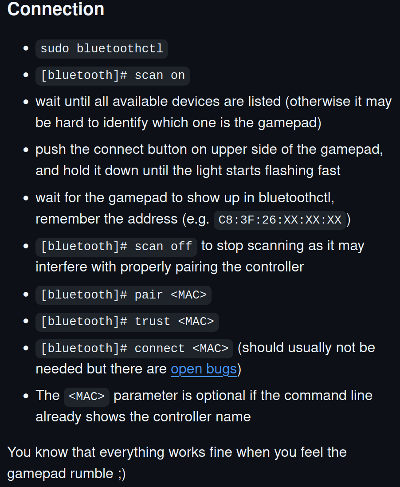
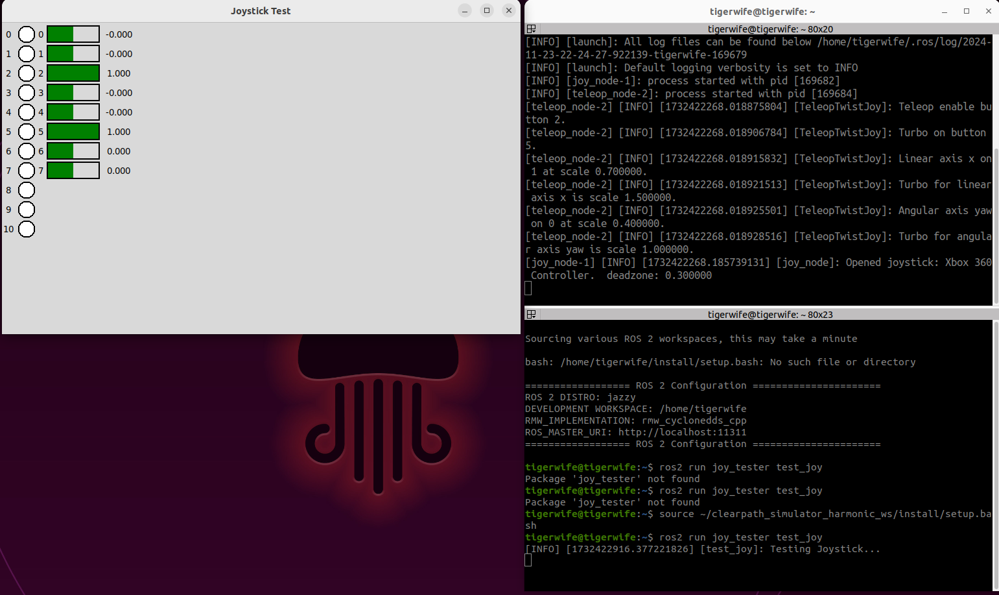
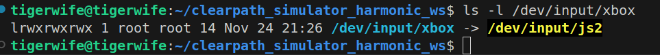

# Clearpath Simulator for Gazebo Harmonic

A modified [Clearpath Simulator](https://github.com/clearpathrobotics/clearpath_simulator) from Clearpath Robotics, that uses ROS 2 Jazzy, Gazebo Harmonic and Moveit2, Nav2 [Jazzy compliant] packages. Clearpath used a **single yaml** file to define its robots. More details here https://docs.clearpathrobotics.com/docs/ros/config/yaml/overview/. I have opted to use the BSD-3 license, the same as that of ```jazzy``` branch from [clearpath_simulator](https://github.com/clearpathrobotics/clearpath_simulator/tree/jazzy).

## Compatibility

* Ubuntu 22.04: Requires three workspaces in order ROS 2 Jazzy --> Gazebo Harmonic --> Moveit2, Nav2 --> this workspace
* Ubuntu 24.04: **TODO** Requires testing

## Major Changes

* ```warehouse.sdf``` is now ```warehouse_cpr.sdf``` and is compatible with Gazebo Harmonic.


* List of packages that were modified / needs to use my fork
   * clearpath_simulation: https://github.com/Mechazo11/clearpath_simulator_harmonic 
   * clearpath_generator_common
   * clearpath_gz
   * clearpath_config: This package in particular has significant changes, one major being addition of the Xbox One/360 controller support


* In a number of packages like the ```clearpath_harmonic```, ```clearpath_generator_common```, the last line of the file's BSD license had the following statement 

```text
Redistribution and use in source and binary forms, with or without
modification, is not permitted without the express permission
of Clearpath Robotics.
```

* In my opinion, I find this line to be in contradiction with the BSD-3 license that was used with the simulator. The ```.py``` files where I have made the modifications to accept custom yaml file names, I have removed this last line. An issue discussing this matter with Clearpath robotics can be found here: [Issue #]()

* To find out where `ros2_control`, `gazebo` plugins and `ros_gz_bridge` elements of A200 Husky robots are defined, start looking into ```clearpath_common/clearpath_platform_description/urdf/a200```. The same is true for the other supported robots

## Useful Resources

* [Simulate](https://docs.clearpathrobotics.com/docs/ros/tutorials/simulator/simulate/)
* [Migration from Gazebo Classic: SDF](https://gazebosim.org/api/sim/8/migrationsdf.html)
* [ROS 2 and Gazebo Integration Best Practices](https://vimeo.com/showcase/9954564/video/767127300)
* [Spherical Coordinates](https://gazebosim.org/api/sim/8/spherical_coordinates.html)
* [Finding resources](https://gazebosim.org/api/sim/8/resources.html)
* [GZ_SIM_RESOURCE_PATH](https://robotics.stackexchange.com/questions/108511/what-should-gz-sim-resource-path-be-pointing-to)
* [ros2_control_demos](https://github.com/ros-controls/ros2_control_demos)
* [Simulation of a 4WS Robot Using ROS2 Control and Gazebo](https://www.youtube.com/watch?v=VX53gAXafUA): This example moved a 4W drive robot using ros2_control
* Joystick nodes are launched from the ```clearpath_common/clearpath_control/teleop_joy.launch.py``` file

## Preamble

* If you are using Ubuntu 22.04, and had previously used ROS 2 Humble, you need to first ensure that the ROS 2 Humble global workspace is not sourced. The first step is to just comment out ```source /opt/ros/humble/setup.bash``` from ```.bashrc``` file. 

* [Optional] step: Remove ```/opt/ros/humble``` from global ```PATH``` variable. 

```bash
echo $PATH # check /opt/ros/humble is included in the PATH variable
export PATH=$(echo $PATH | tr ':' '\n' | grep -v "/opt/ros/humble" | tr '\n' ':' | sed 's/:$//')
```

* **WARNING!!** in the event the above doesn't work, the easiest thing to do is to remove ROS 2 Humble binaries from **system-level** using ```sudo apt remove ros-humble*```. Please note, if you need to use ROS 2 Humble again, you would need to reinstall the binaries or build ROS 2 humble from source.


## Install Prerequisits

```bash
sudo apt update
sudo apt upgrade
sudo apt-get install python3-dev python3-tk libyaml-cpp-dev joystick
pip3 install numpy catkin_pkg empy lark jinja2 typeguard pyyaml 
```

### Build and Install this workspace.

* If you are using **Ubuntu 24.04**, you can skip the steps of setting up ROS 2 Jazzy, Moveit, Nav2 and Gazebo Harmonic workspaces since, binaries to install them will be available and in theory would be installed by the ```rosdep install``` command. In this case make sure to first invoke ```sudo rosdep update``` first.

* If you are using **Ubuntu 22.04**, then build the following workspaces in sequence. Allot about ~ 1 hr and ~40Gb of disk space
  
  * Build a **ROS 2 Jazzy** workspace: https://github.com/Mechazo11/ubuntu22_jazzy_ws
  
  * Build **Gazebo Harmonic** workspace: https://github.com/Mechazo11/gazebo_harmonic_ws
  
  * Build **Moveit2, Nav2** (Jazzy compatible) workspace: https://github.com/Mechazo11/moveit2_jazzy_ws
  
  * Build this workspace using the following steps

```bash
cd ~
git clone https://github.com/Mechazo11/clearpath_simulator_harmonic_ws.git
cd clearpath_simulator_harmonic_ws/
mkdir src
vcs import src < clearpath_sim.repos --recursive
rosdep install -r --from-paths src --rosdistro jazzy -i -y
source ~/ubuntu22_jazzy_ws/install/setup.bash
source ~/gazebo_harmonic_ws/install/setup.bash
source ~/moveit2_jazzy_ws/install/setup.bash
colcon build --symlink-install --cmake-args -DCMAKE_CXX_FLAGS="-w"
```

## Install and verify a gamepad [OPTIONAL]

The following instructions are valid for a Xbox One game controller. For PS4/PS5 or wired controllers, please look for them online.

* Ensure ```dkms```, ```bluez``` and ```xpadneo``` drivers are installed. Bu default ```dkms``` and ```linux headers``` will be installed in Ubuntu 22.04. Install ```bluez```: ```sudo apt-get install bluez```

* Install ```xpadneo```

```bash
cd ~Downloads/
git clone https://github.com/atar-axis/xpadneo.git
cd ~xpandneo/
sudo ./install.sh
```

* Pair a Xbox controller, follow the steps shown below



* Clone ```joy_tester``` library and build it

```bash
cd ~/clearpath_simulator_harmonic_ws/src
git clone https://github.com/joshnewans/joy_tester.git
cd ..
colcon build --packages-select joy_tester
source ./install/setup.bash
```

* Then launch the ```joy_tester``` package to test if all the buttons are working properly.

  * In one terminal, run the teleop_twist_joy
  ```bash
  ros2 launch teleop_twist_joy teleop-launch.py joy_config:='xbox'
  ```

  * In the other terminal run the ```test_joy```
  ```bash
  source ~/clearpath_simulator_harmonic_ws/install/setup.bash
  ros2 run joy_tester test_joy
  ```

  * If successfull you should see something like the following
  

* Now identify which ```jsx``` represents the connected gamepad. First find out how many ```jsx``` device nodes are there

```bash
ls /dev/input/js*
```

* Test each node until you find the one that reacts with a button press. In my case it was ```js2``` node

```bash
jstest /dev/input/js2
```

* Now create a symbolic link between this node and ```/dev/input/xbox``` and create udev rule

  * Create symbolic links and ```udev``` rule: ```sudo ln -s /dev/input/js2 /dev/input/xbox```
  * Identify unique properties: 
  
  ```bash
  udevadm info -a -n /dev/input/js2 | grep -E 'ATTRS{idVendor}|ATTRS{idProduct}|ATTRS{name}'
  ```.
  
  An **example** is shown below, DO NOT COPY THESE

  ```bash
    ATTRS{name}=="Xbox Wireless Controller"
    ATTRS{idProduct}=="0032"
    ATTRS{idVendor}=="8087"
    ATTRS{idProduct}=="0608"
    ATTRS{idVendor}=="05e3"
    ATTRS{idProduct}=="0002"
    ATTRS{idVendor}=="1d6b"
  ```

  * Create udev rule file: ```sudo nano /etc/udev/rules.d/99-xbox-controller.rules``` and copy these attributes (after filling them out wiht idVendor and idProduct unique to your controller)

  ```bash
  SUBSYSTEM=="input", KERNEL=="js[0-9]*", ATTRS{idVendor}=="05e3", ATTRS{idProduct}=="0002", SYMLINK+="input/xbox"
  ```
  
  Make sure to change with actual values
  * Reload Udev rules and trigger

  ```bash
    sudo udevadm control --reload-rules
    sudo udevadm trigger
  ```

  * Verify simlink: ```ls -l /dev/input/xbox``` you should see something like this
  

## Preparations before launch

* Verify installation: In a new terminal, source all workspaces in the following sequence

```bash
source ~/ubuntu22_jazzy_ws/install/setup.bash
source ~/gazebo_harmonic_ws/install/setup.bash
source ~/moveit2_jazzy_ws/install/setup.bash
source ~/clearpath_simulator_harmonic_ws/install/setup.bash
```

* Append location of the ```world``` file to the current value of ```GZ_SIM_RESOURCE_PATH``` env variable

```bash
export GZ_VERSION=harmonic 
export GZ_SIM_RESOURCE_PATH=$GZ_SIM_RESOURCE_PATH:~/clearpath_simulator_harmonic_ws/install/clearpath_gz/share/clearpath_gz/worlds
```

* [OPTIONAL IF YOU HAD REBOOTED THE SYSTEM] Recreate symlink and reload udev rules. Do the following

```bash
sudo ln -s /dev/input/js2 /dev/input/xbox
sudo udevadm control --reload-rules
sudo udevadm trigger
ls -l /dev/input/xbox
```

## Launch simulation

```bash
ros2 launch clearpath_gz empty_launch.py robot_config_yaml:=husky_a200_sample.yaml
```

* Test robot's movement with a TwistStamped message

```bash
ros2 topic pub /a200_0000/platform_velocity_controller/cmd_vel geometry_msgs/msg/TwistStamped "{header: {stamp: {sec: 0, nanosec: 0}, frame_id: 'base_link'}, twist: {linear: {x: 1.0, y: 0.0, z: 0.0}, angular: {x: 0.0, y: 0.0, z: 0.5}}}"
```

* If the robot moves, then all controller configurations have been setup correctly, now we can use a gamepad to control the robot

* Control the robot's movement
  * Press and Hold ```LB``` to enable teleop
  * Press and Hold ```RB``` to enable faster movement
  * Analog stick 1 controls both linear and angular velocities

* Launch the ```warehouse_cpr``` world that brings in a A200 Husky robot

```bash
ros2 launch clearpath_gz simulation.launch.py robot_config_yaml:=husky_a200_sample.yaml
```

* Fixing controller_manager crashing gazebo

ros2 launch gz_ros2_control_demos cart_example_position.launch.py

---

### Future TODO

* [x] Fix the ```warehouse``` world, ensure husky robot simulates correctly

* [x] Write instructions for installing and test driving robot around with a gamepad / rqt_joystick

* [ ] Make sure gazebo_ros2_control_demos works correctly

* [ ] Add a command that creates a folder uniquely named as the custom yaml folder's name
instead of ***robot_yamls***. 

* [ ] In ROS 1, Clearpath Robotics introduced the ```cpr_gazebo``` repository which contained a good number of indoor and outdoor worlds. However that simulator is no longer maintained. I started a [port](https://github.com/Mechazo11/cpr_gazebo_ros2) for ROS 2 use but this requires a significant time and effort. If you are interested to help out and contribute, please don't hestiate to reaching out to me.

### Useful resources

Collection of some random helpful resources

* teleop_twist_joy: https://github.com/ros2/teleop_twist_joy
* Teleo with a joystick: https://articulatedrobotics.xyz/tutorials/mobile-robot/applications/teleop/
* teleop_twist_joy: https://github.com/ros2/teleop_twist_joy
* On using Substitutions in ROS 2 launch files: https://daobook.github.io/ros2-docs/xin/Tutorials/Launch-Files/Using-Substitutions.html
* Pose publisher demo: https://github.com/gazebosim/gz-sim/blob/gz-sim8/examples/worlds/pose_publisher.sdf
* Documentations on using gazebo_ros2_control: https://control.ros.org/rolling/doc/gazebo_ros2_control/doc/index.html
* ROS 2 Gazebo tutorial robot simulation with `ros2_control`: https://www.youtube.com/watch?v=PM_1Nb9u-N0
* An excellent example for correctly defining `ros2_control` plugin names to connect with Gazebo Harmonic: https://www.youtube.com/watch?v=u54WAlAewMU


---


/a200_0000/cmd_vel
/a200_0000/diagnostics
/a200_0000/dynamic_joint_states
/a200_0000/joint_state_broadcaster/transition_event
/a200_0000/joy_teleop/cmd_vel
/a200_0000/joy_teleop/joy
/a200_0000/joy_teleop/joy/set_feedback
/a200_0000/platform/cmd_vel_unstamped
/a200_0000/platform/emergency_stop
/a200_0000/platform/joint_states
/a200_0000/platform/odom
/a200_0000/platform/odom/filtered
/a200_0000/platform_velocity_controller/cmd_vel
/a200_0000/platform_velocity_controller/transition_event
/a200_0000/rc_teleop/cmd_vel
/a200_0000/robot_description
/a200_0000/set_pose
/a200_0000/tf
/a200_0000/tf_static
/a200_0000/twist_marker_server/cmd_vel
/a200_0000/twist_marker_server/feedback
/a200_0000/twist_marker_server/update
/clock
/parameter_events
/rosout